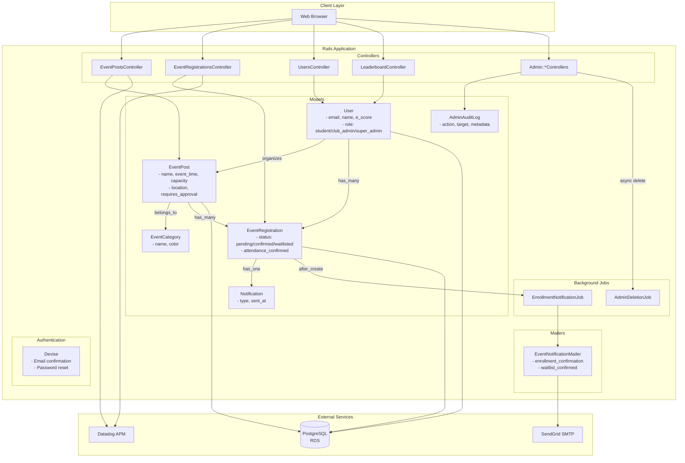
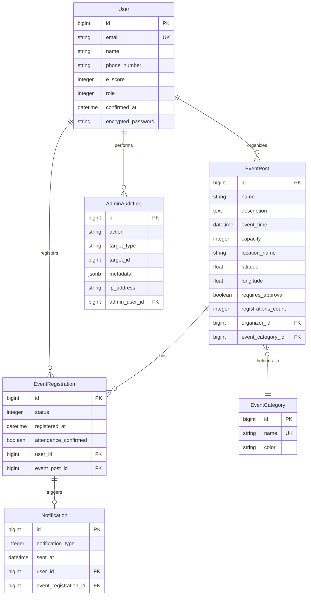

# Backend Architecture

## Rails Application Structure

## Tech Stack

| Component | Technology |
|-----------|-----------|
| Framework | Ruby on Rails 8.1 |
| Database | PostgreSQL (AWS RDS) |
| Authentication | Devise (email confirmation required) |
| Frontend | Turbo, Stimulus, Importmap |
| Asset Pipeline | Propshaft |
| Web Server | Puma |
| Async Jobs | Rails ActiveJob (async adapter) |
| Email | SendGrid SMTP |
| APM/Monitoring | Datadog |
| Testing | RSpec + FactoryBot |

---

## Database Entity Relationship Diagram

## Key Design Patterns

### Counter Cache
- `EventPost.registrations_count` only counts **confirmed** registrations
- Used for performance optimization in event listings

### Waitlist Management
- Auto-waitlist if event is full on registration
- Auto-promote oldest waitlisted person when confirmed spot opens
- Unless event requires manual approval

### E-Score Gamification
- +10 points awarded when organizer confirms attendance
- Leaderboard ranks top 10 by E-score descending

### Admin Audit Trail
- Every admin deletion logged before async execution
- Captures IP address, user agent, deletion reason, cascade impact
