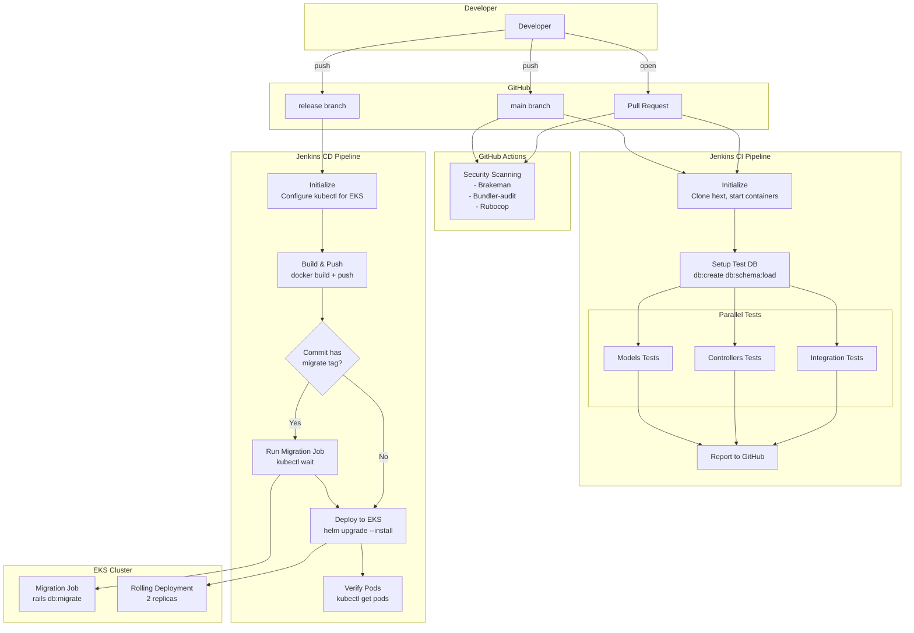

# CI/CD Pipeline

## Pipeline Flow



## CI Pipeline (Jenkins)

**Triggers:** Push to `main`, PRs to `main`

### Stages

1. **Initialize**
   - Clone hext CLI repo
   - Start Rails + PostgreSQL containers
   - Create `.env` with secrets

2. **Setup Test DB**
   - `db:drop db:create db:schema:load`
   - Uses `e_ren_test` database

3. **Parallel Tests**
   - `spec/models` - Model unit tests
   - `spec/controllers` - Controller tests
   - `spec/requests`, `spec/views`, `spec/integration` - Integration tests

4. **Cleanup**
   - `hext down` - Stop containers

**Location:** `.jenkins/ci.Jenkinsfile`

---

## CD Pipeline (Jenkins)

**Triggers:** Push to `release` branch

### Stages

1. **Initialize**
   - Configure `kubectl` for EKS cluster
   - Verify Docker, AWS CLI, kubectl, Helm

2. **Build & Push**
   - `hext push` - Build and push to DockerHub
   - Image: `duyiqun/eren:latest`

3. **Check Migrations**
   - Inspect commit message for `[migrate]` tag
   - Sets `HAS_MIGRATIONS` env var

4. **Deploy**
   - If `[migrate]`: Run migration job, wait for completion
   - `hext deploy` - Helm upgrade to EKS

5. **Verify**
   - `kubectl get pods -l app=e-ren`

**Location:** `.jenkins/cd.Jenkinsfile`

---

## GitHub Actions (Security)

**Triggers:** All pushes and PRs

### Checks
- **Brakeman** - Rails security vulnerabilities
- **Bundler-audit** - Gem vulnerabilities
- **Importmap audit** - JS dependency vulnerabilities
- **Rubocop** - Code style linting

**Location:** `.github/workflows/ci.yml`

---

## Migration Strategy

### Triggering Migrations

Include `[migrate]` in your commit message:

```bash
git commit -m "Add user preferences table [migrate]"
```

### What Happens

1. CD pipeline detects `[migrate]` tag
2. Creates Kubernetes Job: `e-ren-migrate-vN`
3. Job runs: `bundle exec rails db:migrate`
4. Pipeline waits for job completion (5-min timeout)
5. Job auto-deletes after 10 minutes
6. Then deploys app pods

### Manual Migration

```bash
kubectl apply -f migration-job.yaml
kubectl wait --for=condition=complete job/e-ren-migrate-vN --timeout=300s
```
