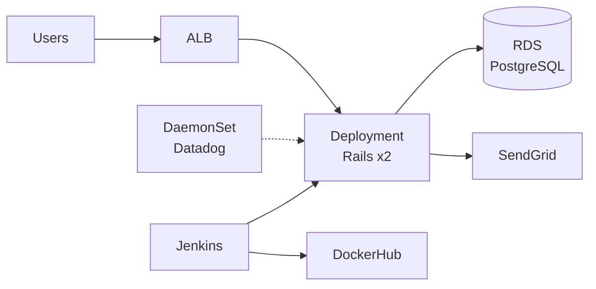
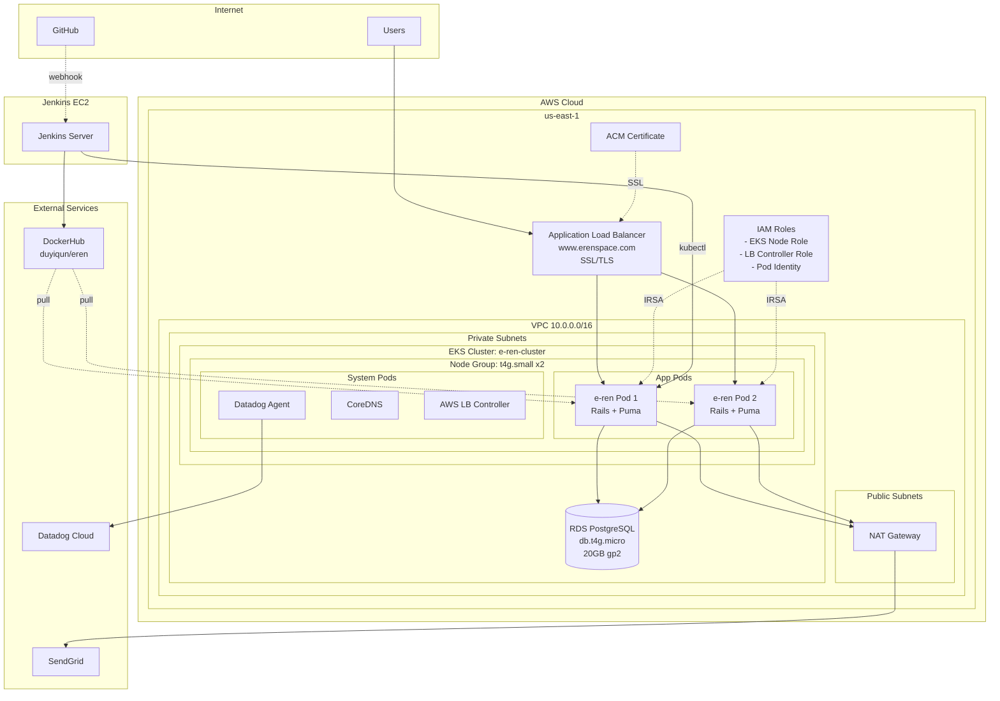
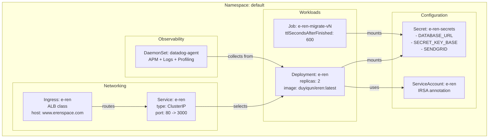

# Cloud Infrastructure (AWS + EKS)

## High-Level Overview

---

## Architecture Overview

## AWS Services Used

| Service | Purpose | Configuration |
|---------|---------|----------------|
| **EKS** | Kubernetes cluster | 2 nodes (t4g.small), v1.29 |
| **EC2** | Node instances | 2x t4g.small (ARM) |
| **VPC** | Networking | 10.0.0.0/16, 2 AZs, NAT gateway |
| **RDS** | PostgreSQL database | db.t4g.micro, 20GB gp2, Single-AZ |
| **ALB** | Load balancer | Ingress controller managed |
| **ACM** | SSL certificate | Managed by AWS |
| **IAM** | Access control | IRSA for EKS pods |

## Estimated Monthly Cost

| Component | Specification | Cost/Month |
|-----------|---------------|-----------|
| EKS Cluster | 1.29, 2x t4g.small nodes | ~$110 |
| RDS PostgreSQL | db.t4g.micro, 20GB | ~$14 |
| VPC/NAT | Single NAT gateway, 2 AZs | ~$40 |
| ALB | AWS Load Balancer | ~$16 |
| **Total** | | **~$180** |

---

## Kubernetes Resources

## Resource Specifications

### Deployment
- **Replicas:** 2 (fixed, no autoscaling)
- **Image:** `duyiqun/eren:latest`
- **CPU:** 250m request / 500m limit
- **Memory:** 256Mi request / 512Mi limit
- **Probes:** Liveness & readiness on `/up`

### Migration Job
- **Trigger:** `[migrate]` tag in commit message
- **Command:** `bundle exec rails db:migrate`
- **TTL:** Auto-cleanup after 10 minutes

### Secrets (Kubernetes)
- `DATABASE_URL` - RDS connection string
- `SECRET_KEY_BASE` - Rails encryption key
- `SENDGRID` - Email API key
