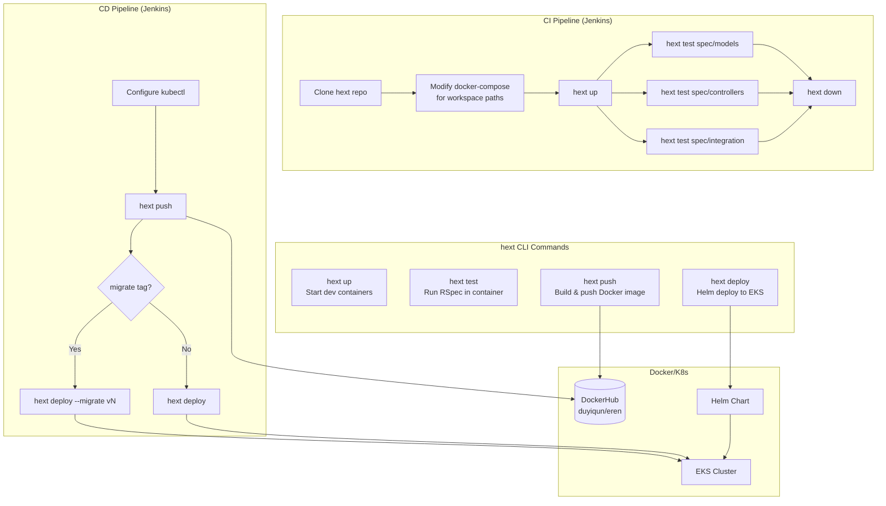

# hext CLI (CI/CD Tooling)

## Overview

`hext` is a Python CLI that wraps Docker Compose and Helm for consistent dev/CI/CD operations.



## Commands

### `hext up`
Start development containers (Rails + PostgreSQL)

```bash
hext up
# Equivalent to: docker-compose up -d
```

### `hext test [path]`
Run RSpec tests in the Rails container

```bash
hext test                    # All tests
hext test spec/models        # Models only
hext test spec/models/user_spec.rb --format documentation
```

### `hext push`
Build production Docker image and push to DockerHub

```bash
hext push
# Builds: docker build --platform linux/arm64 -t duyiqun/eren:latest .
# Pushes: docker push duyiqun/eren:latest
```

### `hext deploy [--migrate VERSION]`
Deploy to EKS using Helm

```bash
hext deploy                    # Deploy without migrations
hext deploy --migrate v42      # Deploy with migration job
```

### `hext down`
Stop and remove containers

```bash
hext down
# Equivalent to: docker-compose down
```

### `hext shell`
Open bash shell in Rails container

```bash
hext shell
# Equivalent to: docker exec -it e_ren_rails bash
```

## Technical Nuance

**Jenkins Workspace Path Fix**

In CI, the workspace structure differs from local dev:

```
Local:
~/projects/
├── e_ren/        # Rails app
└── e_ren_infra/  # docker-compose lives here
    └── hext

Jenkins:
/var/lib/jenkins/workspace/e_ren_ci/
├── (Rails app files here)
└── hext/         # Cloned in CI
```

So we `sed` the docker-compose.yml:

```bash
# CI Jenkinsfile
sed -i 's|../e_ren:/rails|..:/rails|g' hext/docker-compose.yml
sed -i 's|CONTAINER_NAME = "hext_rails"|CONTAINER_NAME = "e_ren_rails"|g' hext
```

## Source Code

Located at: `https://github.com/duduyiq2001/hext`

```
hext/
├── hext              # Python CLI script
├── setup.sh          # Installation script
├── docker-compose.yml
├── Dockerfile.dev
└── helm-charts/
    └── e-ren/        # Helm chart for EKS deployment
```
