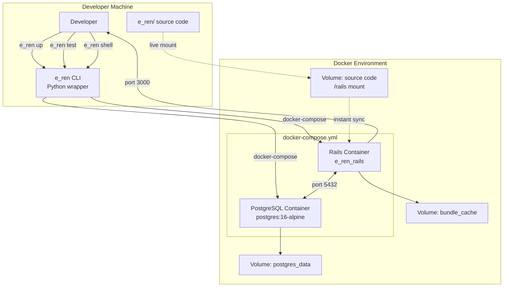

# Local Development Setup

## e_ren CLI + Docker Environment



## CLI Commands

```bash
e_ren up      # Start containers (auto-build on first run)
e_ren test    # Run all RSpec tests
e_ren test spec/models/user_spec.rb  # Run specific test
e_ren shell   # Bash into Rails container
e_ren logs    # Tail container logs
e_ren down    # Stop and remove containers
e_ren build   # Rebuild Docker image (only if Dockerfile changes)
```

## Technical Nuance

**Live Code Sync**

Source code is volume-mounted into the container:

```yaml
# docker-compose.yml
volumes:
  - ../e_ren:/rails
```

This means:
- Edit code on your Mac
- Changes are **instantly** reflected in the container
- No rebuild needed for code changes
- Only rebuild when `Dockerfile` or `Gemfile` changes

## First Time Setup

```bash
# 1. Clone repos
cd ~/projects
git clone git@github.com:yourorg/e_ren.git
git clone git@github.com:yourorg/e_ren_infra.git

# 2. Install e_ren CLI (add to PATH)
export PATH="$PATH:$HOME/projects/e_ren_infra"

# 3. Start containers
e_ren up

# 4. Verify
e_ren test  # Should run all specs
```

## Environment Variables

Create `.env` in `e_ren_infra/`:

```bash
GOOGLE_MAP=your_api_key_here
RAILS_ENV=development
```

## Database

- **Container:** `postgres:16-alpine`
- **Port:** 5432 (mapped to host)
- **Database:** `e_ren_development` (dev), `e_ren_test` (test)
- **Credentials:** `postgres:password`

## Troubleshooting

### Container won't start
```bash
e_ren down
docker system prune -f
e_ren up
```

### Database issues
```bash
e_ren shell
bin/rails db:drop db:create db:migrate
```

### Gem issues
```bash
e_ren shell
bundle install
```
