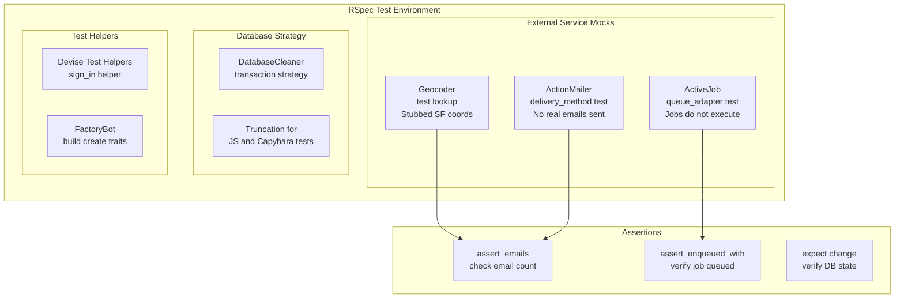

# Testing Strategy

## Test Mocking Architecture



## Technical Nuance

**Geocoder Stubbing**

Geocoding is DISABLED in production (Google Maps API costs). In tests, we use stubbed responses:

```ruby
# config/initializers/geocoder.rb
if Rails.env.test?
  Geocoder.configure(
    lookup: :test,
    ip_lookup: :test
  )

  Geocoder::Lookup::Test.add_stub("any", [
    { 'coordinates' => [37.7749, -122.4194] }  # San Francisco
  ])
end
```

In production, we use dummy WashU coordinates via `before_validation :set_default_coordinates`.

---

## FactoryBot Strategy

```mermaid
graph TB
    subgraph "User Factory"
        UserF[factory :user<br/>sequence email wustl.edu<br/>sequence name<br/>confirmed_at now]
        UserTraits[Traits:<br/>high_score / low_score<br/>confirmed / unconfirmed<br/>organizer / attendee / admin]
    end

    subgraph "EventPost Factory"
        EventF[factory :event_post<br/>sequence name<br/>event_time 2.days.from_now<br/>capacity 20]
        EventAssoc[Associations:<br/>event_category<br/>organizer -> user]
        EventTraits[Traits:<br/>need_approve / full / past<br/>today / tomorrow / this_week<br/>with_attendees / near_location]
    end

    subgraph "EventRegistration Factory"
        RegF[factory :event_registration<br/>registered_at now]
        RegAssoc[Associations:<br/>user / event_post]
        RegTraits[Traits:<br/>pending / confirmed<br/>cancelled / waitlisted]
    end

    subgraph "EventCategory Factory"
        CatF[factory :event_category<br/>sequence name<br/>random color hex]
        CatTraits[Traits:<br/>sports / social<br/>academic / food]
    end

    UserF --> UserTraits
    EventF --> EventAssoc --> EventTraits
    RegF --> RegAssoc --> RegTraits
    CatF --> CatTraits
```



### Best Practices

| Method | Use Case | DB Hit? |
|--------|----------|---------|
| `build(:user)` | Unit tests, no persistence needed | No |
| `build_stubbed(:user)` | Fast tests, fakes persistence | No |
| `create(:user)` | Integration tests, need DB state | Yes |

### Sequences

Prevent unique constraint violations:

```ruby
factory :user do
  sequence(:email) { |n| "user#{n}@example.com" }
  sequence(:name) { |n| "User #{n}" }
end
```

---

## Test Categories

### Unit Tests (`spec/models/`)
- Test model validations, callbacks, scopes
- Mock all external dependencies
- Fast, isolated

### Controller Tests (`spec/controllers/`)
- Test action responses, redirects
- Use `sign_in(user)` for auth

### View Tests (`spec/views/`)
- Test rendered HTML output
- Stub controller helpers (`current_user`, `logged_in?`)
- Use `assign` to set instance variables
- Capybara matchers for assertions

### Integration Tests (`spec/integration/`)
- Test end-to-end flows
- Email delivery verification
- Multiple model interactions

### Request Tests (`spec/requests/`)
- Test API endpoints
- JSON response verification

---

## View Testing Pattern

View specs test the rendered HTML without hitting controllers.

**Key Techniques:**

```ruby
# spec/views/event_posts/index.html.erb_spec.rb
RSpec.describe "event_posts/index.html.erb", type: :view do
  let(:current_user) { create(:user) }

  before do
    # Stub controller helpers
    without_partial_double_verification do
      allow(view).to receive(:current_user).and_return(current_user)
      allow(view).to receive(:logged_in?).and_return(true)
    end
  end

  it "displays event names" do
    # Assign instance variables the view expects
    assign(:event_posts, [create(:event_post, name: "Basketball")])
    assign(:user_registrations, {})

    render

    # Assert on rendered HTML
    expect(rendered).to have_content("Basketball")
    expect(rendered).to have_link("Post New Event")
    expect(rendered).to have_button("Register", visible: :all)
  end
end
```

**View Specs We Have:**
- `event_posts/index` - Event listing, counts, category filters
- `event_posts/show` - Event details, register/unregister buttons, organizer actions
- `event_posts/search` - Search results display
- `event_posts/registrations` - Registration management for organizers
- `users/show` - User profile, E-score, event history
- `pages/about` - Onboarding page

---

## Running Tests

```bash
# All tests
e_ren test

# Specific file
e_ren test spec/models/user_spec.rb

# Specific directory
e_ren test spec/models

# With format
e_ren test spec/models --format documentation

# In CI (parallel)
e_ren test spec/models &
e_ren test spec/controllers &
e_ren test spec/integration &
wait
```

---

## Email Testing

```ruby
# spec/integration/event_registration_emails_spec.rb
describe "registration emails" do
  include ActionMailer::TestHelper

  it "sends confirmation on confirmed registration" do
    expect {
      create(:event_registration, status: :confirmed)
    }.to have_enqueued_mail(EventNotificationMailer, :enrollment_confirmation)
  end

  it "does NOT send email for pending registration" do
    expect {
      create(:event_registration, :pending)
    }.not_to have_enqueued_mail(EventNotificationMailer)
  end
end
```

---

## Job Testing

```ruby
# spec/jobs/enrollment_notification_job_spec.rb
describe EnrollmentNotificationJob do
  include ActiveJob::TestHelper

  it "sends email" do
    registration = create(:event_registration)

    expect {
      described_class.perform_now(registration.id)
    }.to change { ActionMailer::Base.deliveries.count }.by(1)
  end

  it "handles missing registration gracefully" do
    expect {
      described_class.perform_now(999999)
    }.not_to raise_error
  end
end
```
