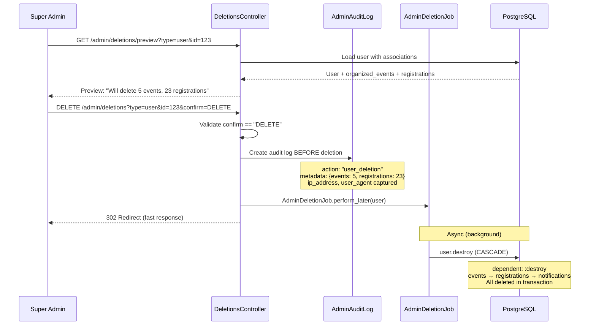

# Admin Deletion Flow

## Async Deletion with Audit Trail



## Technical Nuance

**Why audit log BEFORE async deletion?**

The audit log is created synchronously before the async job is queued. This ensures:

1. **Reliability**: Even if the background job fails, we have a record of the deletion attempt
2. **Compliance**: Audit trail exists immediately, not dependent on job success
3. **Fast Response**: Admin sees immediate feedback while heavy deletion happens in background

## Cascade Deletion Order

```
User
├── organized_events (EventPost)
│   ├── event_registrations
│   │   └── notifications
│   └── (counter caches updated)
└── event_registrations (as attendee)
    └── notifications
```

## Safety Measures

1. **Confirmation Required**: Must type "DELETE" exactly
2. **Preview First**: Shows cascade impact before deletion
3. **Super Admin Only**: Requires `super_admin` role
4. **IP/User Agent Captured**: For security auditing

## Code Reference

```ruby
# app/controllers/admin/deletions_controller.rb
def destroy
  return render_error("Type DELETE to confirm") unless params[:confirm] == "DELETE"

  # Audit BEFORE async deletion
  AdminAuditLog.create!(
    admin_user: current_user,
    action: "#{target_type}_deletion",
    target_type: target_type,
    target_id: target.id,
    metadata: cascade_info,
    ip_address: request.remote_ip,
    user_agent: request.user_agent
  )

  AdminDeletionJob.perform_later(target)
  redirect_to admin_dashboard_path, notice: "Deletion queued"
end
```
