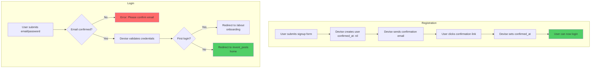

# Authentication Flow (Devise)

## Registration & Login Flow



## Technical Nuance

**Strict Email Confirmation**

```ruby
# config/initializers/devise.rb
config.allow_unconfirmed_access_for = 0.days  # Must confirm immediately
config.confirm_within = 3.days                 # Link expires in 3 days
```

This means:
- Users **cannot** access the app without confirming email
- No grace period for unconfirmed accounts
- Confirmation link expires after 3 days

## First-Time Login Detection

```ruby
# app/controllers/application_controller.rb
def after_sign_in_path_for(resource)
  if resource.sign_in_count == 1
    about_path  # Onboarding page
  else
    root_path   # Event listings
  end
end
```

## User Roles

| Role | Value | Permissions |
|------|-------|-------------|
| `student` | 0 | Create events, register, view leaderboard |
| `club_admin` | 1 | Same as student (reserved for future) |
| `super_admin` | 2 | Delete users/events, view audit logs |

## Session Management

- **Remember me**: Optional, extends session
- **Timeout**: Uses Rails default session expiry
- **Password recovery**: Email-based reset flow

## Security Features

1. **bcrypt** password hashing
2. **CSRF** protection (Rails default)
3. **Email confirmation** required
4. **Rate limiting** (TODO: implement)
