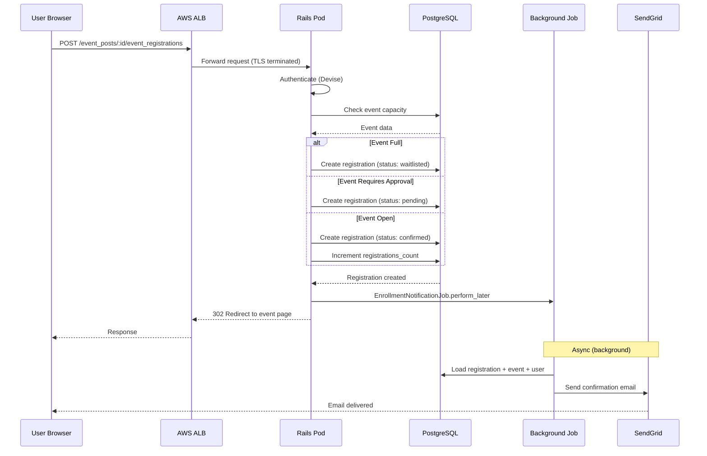

# Event Registration Flow

## Sequence Diagram



## Registration Status Logic

| Condition | Status | Email Sent? |
|-----------|--------|-------------|
| Event has space, no approval required | `confirmed` | Yes - enrollment confirmation |
| Event has space, requires approval | `pending` | No - wait for organizer |
| Event is full | `waitlisted` | Yes - waitlist notification |

## Counter Cache Behavior

- Only **confirmed** registrations are counted
- `EventPost.registrations_count` is incremented/decremented automatically
- Used to determine if event is "full"

## Code Reference

```ruby
# app/models/event_registration.rb
def set_initial_status
  if event_post.full?
    self.status = :waitlisted
  elsif event_post.requires_approval?
    self.status = :pending
  else
    self.status = :confirmed
  end
end
```
