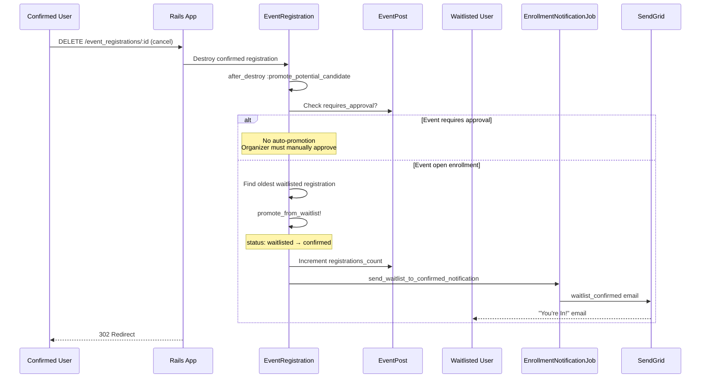

# Waitlist Promotion Flow

## Automatic Promotion Sequence



## Technical Nuance

**Counter Cache with Status Transition**

The counter cache only counts confirmed registrations. When promoting from waitlist:

1. Standard `counter_cache` doesn't trigger on `update` (only `create`/`destroy`)
2. We manually increment `registrations_count` in `promote_from_waitlist!`

```ruby
def promote_from_waitlist!
  self.status = :confirmed
  save!
  # Manual increment because update doesn't trigger counter cache
  event_post.increment!(:registrations_count)
end
```

## Promotion Logic

```ruby
# app/models/event_registration.rb
def promote_potential_candidate
  return if event_post.requires_approval?

  next_in_line = event_post.waitlisted_registrations
                           .order(:registered_at)
                           .first

  next_in_line&.promote_from_waitlist!
end
```

## Promotion Rules

| Scenario | Auto-Promote? | Reason |
|----------|---------------|--------|
| Open event, spot opens | Yes | Fair to waitlist |
| Approval-required event | No | Organizer decides |
| No one on waitlist | N/A | Nothing to promote |

## Email Sent

When promoted, user receives **waitlist_confirmed** email:

> Subject: You're In! Your spot for [Event Name] is confirmed
>
> Great news! A spot opened up and you've been moved from the waitlist to confirmed.
