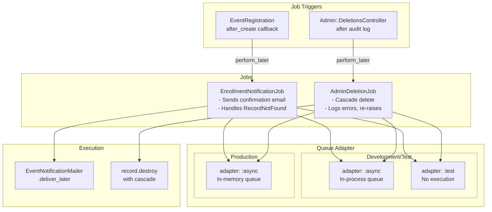

# ActiveJob Architecture

## Job Flow



## Technical Nuance

**Why `:async` adapter instead of Solid Queue?**

We use Rails' built-in `:async` adapter to avoid a separate database dependency:

```ruby
# config/application.rb
config.active_job.queue_adapter = :async
```

**Trade-offs:**

| Aspect | `:async` Adapter | Solid Queue |
|--------|------------------|-------------|
| Database | No separate DB needed | Requires queue tables |
| Persistence | Jobs lost on restart | Jobs survive restart |
| Workers | In-process with Rails | Separate worker process |
| Complexity | Simple | More setup |
| Reliability | Lower | Higher |

For our scale, `:async` is sufficient. For production reliability at scale, consider Solid Queue.

---

## Jobs

### EnrollmentNotificationJob

Sends email when user registers for an event.

```ruby
# app/jobs/enrollment_notification_job.rb
class EnrollmentNotificationJob < ApplicationJob
  queue_as :default

  def perform(registration_id)
    registration = EventRegistration.find(registration_id)
    EventNotificationMailer.enrollment_confirmation(registration).deliver_now
  rescue ActiveRecord::RecordNotFound
    Rails.logger.warn "Registration #{registration_id} not found, skipping email"
  end
end
```

**Error Handling:** Gracefully handles `RecordNotFound` (e.g., if registration deleted before job runs).

---

### AdminDeletionJob

Performs async cascade deletion after audit logging.

```ruby
# app/jobs/admin_deletion_job.rb
class AdminDeletionJob < ApplicationJob
  queue_as :default

  def perform(record)
    record.destroy!
  rescue => e
    Rails.logger.error "Deletion failed: #{e.message}"
    raise  # Re-raise for retry mechanism
  end
end
```

**Error Handling:** Logs and re-raises for retry. Audit log was already created synchronously.

---

## Job Triggering

### From Model Callbacks

```ruby
# app/models/event_registration.rb
after_create :send_enrollment_notification, unless: :pending?

private

def send_enrollment_notification
  EnrollmentNotificationJob.perform_later(id)
end
```

### From Controllers

```ruby
# app/controllers/admin/deletions_controller.rb
def destroy
  # Audit log created synchronously first
  AdminAuditLog.create!(...)

  # Then async deletion
  AdminDeletionJob.perform_later(@target)

  redirect_to admin_dashboard_path
end
```

---

## Testing Jobs

```ruby
# spec/jobs/enrollment_notification_job_spec.rb
describe EnrollmentNotificationJob do
  include ActiveJob::TestHelper

  it "enqueues on registration create" do
    expect {
      create(:event_registration)
    }.to have_enqueued_job(described_class)
  end

  it "sends email when performed" do
    registration = create(:event_registration)

    expect {
      perform_enqueued_jobs
    }.to change { ActionMailer::Base.deliveries.count }.by(1)
  end
end
```
