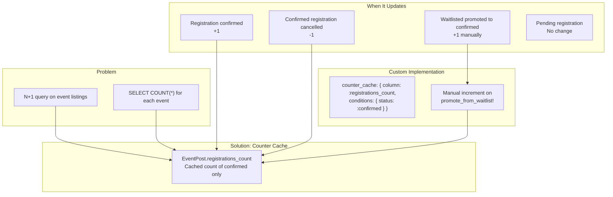

# Counter Cache Strategy

## Problem & Solution



## Technical Nuance

**Why Custom Counter Cache?**

Standard Rails `counter_cache: true` counts ALL associated records. We only want to count **confirmed** registrations.

### Standard Behavior (Not What We Want)
```ruby
belongs_to :event_post, counter_cache: true
# Counts ALL registrations: pending + confirmed + waitlisted
```

### Our Implementation
```ruby
# app/models/event_registration.rb
belongs_to :event_post, counter_cache: {
  column: :registrations_count,
  conditions: -> { confirmed }
}
```

This only increments/decrements when status is `:confirmed`.

---

## Edge Case: Waitlist Promotion

When a user is promoted from waitlist to confirmed, the counter cache doesn't automatically increment because it's an `update`, not a `create`.

**Solution:** Manual increment in `promote_from_waitlist!`

```ruby
# app/models/event_registration.rb
def promote_from_waitlist!
  self.status = :confirmed
  save!

  # Manual increment because update doesn't trigger counter cache
  event_post.increment!(:registrations_count)
end
```

---

## Counter Cache Behavior Matrix

| Action | Counter Change | Automatic? |
|--------|----------------|------------|
| Create confirmed registration | +1 | Yes |
| Delete confirmed registration | -1 | Yes |
| Create pending registration | 0 | N/A |
| Create waitlisted registration | 0 | N/A |
| Approve pending → confirmed | +1 | Yes |
| Promote waitlisted → confirmed | +1 | **Manual** |

---

## Usage in Views

```erb
<%# No N+1 query! Uses cached count %>
<p><%= event.registrations_count %> / <%= event.capacity %> spots filled</p>

<%# Helper method %>
<p><%= event.spots_remaining %> spots remaining</p>
```

```ruby
# app/models/event_post.rb
def spots_remaining
  capacity - registrations_count
end

def full?
  registrations_count >= capacity
end
```

---

## Migration

```ruby
# db/migrate/xxx_add_registrations_count_to_event_posts.rb
class AddRegistrationsCountToEventPosts < ActiveRecord::Migration[7.1]
  def change
    add_column :event_posts, :registrations_count, :integer, default: 0, null: false
  end
end
```

---

## Resetting Counter Cache

If counter gets out of sync:

```ruby
# Rails console
EventPost.find_each do |event|
  EventPost.reset_counters(event.id, :confirmed_registrations)
end
```

Or via migration:

```ruby
class ResetRegistrationCounters < ActiveRecord::Migration[7.1]
  def up
    EventPost.find_each do |event|
      confirmed_count = event.event_registrations.confirmed.count
      event.update_column(:registrations_count, confirmed_count)
    end
  end
end
```

---

## Performance Impact

**Before (N+1):**
```sql
SELECT * FROM event_posts;
-- For each event:
SELECT COUNT(*) FROM event_registrations WHERE event_post_id = 1 AND status = 1;
SELECT COUNT(*) FROM event_registrations WHERE event_post_id = 2 AND status = 1;
SELECT COUNT(*) FROM event_registrations WHERE event_post_id = 3 AND status = 1;
-- ... 100 more queries
```

**After (Counter Cache):**
```sql
SELECT * FROM event_posts;
-- Done! Count is already in registrations_count column
```
