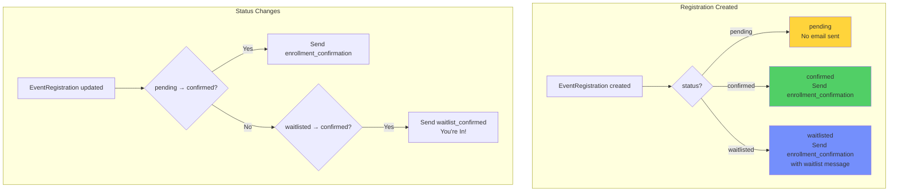

# Email Notification Logic

## Conditional Email Flow



## Technical Nuance

**State Transition Detection with Rails Dirty Tracking**

We use `status_before_last_save` to detect specific state transitions:

```ruby
# app/models/event_registration.rb

# On create - only send if NOT pending
after_create :send_enrollment_notification, unless: :pending?

# On update - detect pending → confirmed
after_update :send_pending_to_confirmed_notification,
  if: -> {
    saved_change_to_status? &&
    confirmed? &&
    status_before_last_save == 'pending'
  }

# On update - detect waitlisted → confirmed
after_update :send_waitlist_to_confirmed_notification,
  if: -> {
    saved_change_to_status? &&
    confirmed? &&
    status_before_last_save == 'waitlisted'
  }
```

**Why this approach?**

1. **Prevents double-emails**: Only sends on specific transitions
2. **Correct email type**: Waitlist promotion gets "You're In!" not generic confirmation
3. **No email for pending**: User waits for organizer approval

---

## Email Types

### enrollment_confirmation
Sent when registration is confirmed or waitlisted.

```
Subject: You're registered for [Event Name]

Hi [User Name],

You're registered for [Event Name] on [Date].

Status: Confirmed / Waitlisted
```

### waitlist_confirmed
Sent when user is promoted from waitlist.

```
Subject: You're In! Your spot for [Event Name] is confirmed

Great news! A spot opened up and you've been moved from the
waitlist to confirmed for [Event Name].
```

---

## Email Templates

Located in `app/views/event_notification_mailer/`:

```
event_notification_mailer/
├── enrollment_confirmation.html.erb
├── enrollment_confirmation.text.erb
├── waitlist_confirmed.html.erb
└── waitlist_confirmed.text.erb
```

---

## Mailer Code

```ruby
# app/mailers/event_notification_mailer.rb
class EventNotificationMailer < ApplicationMailer
  default from: 'noreply@erenspace.com'

  def enrollment_confirmation(registration)
    @registration = registration
    @event = registration.event_post
    @user = registration.user

    mail(
      to: @user.email,
      subject: "You're registered for #{@event.name}"
    )
  end

  def waitlist_confirmed(registration)
    @registration = registration
    @event = registration.event_post
    @user = registration.user

    mail(
      to: @user.email,
      subject: "You're In! Your spot for #{@event.name} is confirmed"
    )
  end
end
```

---

## Testing Emails

```ruby
# spec/integration/event_registration_emails_spec.rb
describe "registration emails" do
  include ActionMailer::TestHelper

  it "sends confirmation for confirmed registration" do
    expect {
      create(:event_registration, status: :confirmed)
    }.to have_enqueued_mail(EventNotificationMailer, :enrollment_confirmation)
  end

  it "does NOT send for pending registration" do
    expect {
      create(:event_registration, :pending)
    }.not_to have_enqueued_mail(EventNotificationMailer)
  end

  it "sends 'You're In!' when promoted from waitlist" do
    registration = create(:event_registration, :waitlisted)

    expect {
      registration.update!(status: :confirmed)
    }.to have_enqueued_mail(EventNotificationMailer, :waitlist_confirmed)
  end
end
```

---

## Production Configuration

```ruby
# config/environments/production.rb
config.action_mailer.delivery_method = :smtp
config.action_mailer.smtp_settings = {
  address: 'smtp.sendgrid.net',
  port: 587,
  user_name: 'apikey',
  password: ENV['SENDGRID'],
  authentication: :plain,
  enable_starttls_auto: true
}

config.action_mailer.default_url_options = {
  host: ENV['APP_HOST'] || 'www.erenspace.com'
}
```
